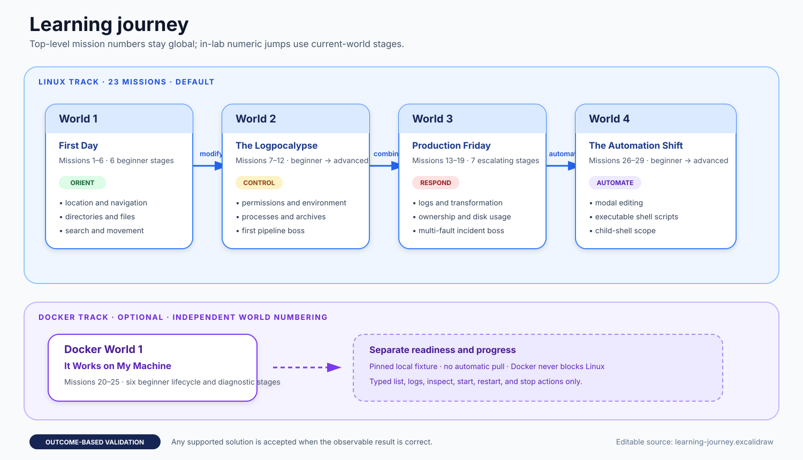

# OpsQuest curriculum

OpsQuest teaches operational problem-solving through incidents rather than isolated command drills. Missions provide a disposable environment, describe an observable goal, and accept any supported command sequence that produces the required outcome.

## Learning journey

Editable source: [`learning-journey.excalidraw`](diagrams/learning-journey.excalidraw)

The curriculum has two independent tracks:

- **Linux:** 23 missions across four ordered worlds. Bare `opsquest play` follows this track.
- **Docker:** six optional Foundations missions in one beginner world. Docker readiness never blocks Linux play.

Display numbers are global across both tracks: Docker occupies Missions 20–25 and Linux World 4 resumes at Mission 26. World and stage positions are derived separately inside each track. Persisted completions use stable mission IDs rather than display numbers, so profiles created before this expansion remain compatible.

The [learning philosophy](learning-philosophy.md) explains the incident loop and feedback model. [Outcome-based mission design](mission-design.md) describes how validators preserve equivalent solutions.

## Current mission map

The “tools” column records suggested commands, not a mandatory solution. Outcome names are the declarative validator types exercised by the mission.

| Global # | Track position | Difficulty | Primary learning focus | Suggested tools | Observable outcomes |
| ---: | --- | --- | --- | --- | --- |
| 1 | Linux W1.1 | Beginner | Identify the current directory | `pwd` | Output equals |
| 2 | Linux W1.2 | Beginner | Inspect and navigate a directory tree | `pwd`, `ls`, `cd` | Current directory equals |
| 3 | Linux W1.3 | Beginner | Read the correct short handoff file | `ls`, `cat`, `less` | Output equals |
| 4 | Linux W1.4 | Beginner | Create directories and files | `ls`, `mkdir`, `touch` | Directory and file exist |
| 5 | Linux W1.5 | Beginner | Search recursively and filter matching files | `find`, `grep` | Output contains all required paths and excludes noise |
| 6 | Linux W1.6 | Beginner | Move a release artifact without losing content | `ls`, `mv`, `cp`, `rm` | Destination content equals; source is missing |
| 7 | Linux W2.1 | Beginner | Inspect and repair executable permissions | `ls`, `stat`, `chmod` | File mode equals |
| 8 | Linux W2.2 | Beginner | Inspect and export environment variables | `env`, `echo`, `export` | Environment value equals |
| 9 | Linux W2.3 | Beginner | Select the opening lines of a startup log | `cat`, `head` | Output equals |
| 10 | Linux W2.4 | Intermediate | Inspect processes and stop the faulty one | `ps`, `kill` | Target stopped; healthy process still running |
| 11 | Linux W2.5 | Intermediate | Inspect and extract an archive | `ls`, `tar` | Extracted content contains and equals expected data |
| 12 | Linux W2.6 | Advanced | Build a multi-stage log-processing pipeline | `cat`, `grep`, `awk`, `sort`, `uniq` | Report file content equals |
| 13 | Linux W3.1 | Beginner | Select the newest log lines | `cat`, `tail` | Output equals |
| 14 | Linux W3.2 | Beginner | Count error records through filtering or a pipeline | `grep`, `wc` | Output equals |
| 15 | Linux W3.3 | Intermediate | Sort and aggregate repeated alerts | `cat`, `sort`, `uniq` | Report lines equal |
| 16 | Linux W3.4 | Intermediate | Repair configuration text while preserving mode | `cat`, `sed`, `vi` | Content and mode equal |
| 17 | Linux W3.5 | Intermediate | Correct ownership and permissions together | `stat`, `chown`, `chmod` | Owner and mode equal |
| 18 | Linux W3.6 | Intermediate | Compare disk usage and identify the right target | `ls`, `du`, `sort`, `tail` | Output includes target and excludes distractor |
| 19 | Linux W3.7 | Advanced | Resolve a multi-fault production incident | `tar`, `sed`, `vi`, `chmod`, `ps`, `kill` | Content, mode, and process-state checks |
| 20 | Docker W1.1 | Beginner | List mission containers and start a stopped service | `docker` | Owned count equals; targets are running |
| 21 | Docker W1.2 | Beginner | Read bounded logs from an exited job | `docker` | Output equals recorded log |
| 22 | Docker W1.3 | Beginner | Identify a successful one-shot job by exit code | `docker` | Output contains logical name and exit code; count equals |
| 23 | Docker W1.4 | Beginner | Stop one worker while preserving metrics | `docker` | Target stopped; healthy target running; count equals |
| 24 | Docker W1.5 | Beginner | Restore two stopped services | `docker` | All targets running; count equals |
| 25 | Docker W1.6 | Beginner | Perform a mixed start/stop handoff | `docker` | Replacement running; retiring target stopped; count equals |
| 26 | Linux W4.1 | Beginner | Inspect and run a supplied report script | `cat`, `less`, `chmod`, `sh` | Report content equals |
| 27 | Linux W4.2 | Beginner | Make a focused configuration edit with a modal editor | `cat`, `vi` | Content and mode equal |
| 28 | Linux W4.3 | Intermediate | Repair, permit, and run a reusable report script | `cat`, `less`, `vi`, `sed`, `chmod`, `sh` | Report content/lines and script mode |
| 29 | Linux W4.4 | Advanced | Reason about child-shell directory and environment scope | `cat`, `less`, `vi`, `sed`, `chmod`, `sh`, `pwd`, `env` | Parent scope preserved; report and script state correct |

## World progression

### Linux World 1: First Day

The opening world establishes orientation and safe filesystem manipulation. It moves from observing location, through navigation and reading, to creation, recursive search, and a small state-changing incident. All six missions are beginner difficulty.

### Linux World 2: The Logpocalypse

This world broadens the state model: permissions, environment, focused log reading, processes, and archives. Its first three stages are beginner-friendly, the next two combine inspection with mutation, and Stage 6 is the first advanced boss and sustained pipeline exercise.

### Linux World 3: Production Friday

The third world reinforces text inspection, counting, and transformation while adding ownership and disk-usage reasoning. Its seven stages culminate in a multi-fault incident that combines archive extraction, configuration repair, permissions, and process control.

### Linux World 4: The Automation Shift

The final Linux world moves from executing a supplied script to repairing reusable automation. It introduces the modal editor, executable virtual scripts, and the difference between child-shell scope and durable virtual state.

### Docker World 1: It Works on My Machine

Docker Foundations progresses through listing, logs, sanitized exit status, targeted stop, multi-service recovery, and a mixed lifecycle handoff. Logical aliases hide real container names and IDs, keeping every lesson focused on observable state for exact attempt-owned resources.

## Curriculum evolution

The expanded map fills the early file-reading, focused log-preview, simple counting, supplied-script, and beginner Docker lifecycle gaps. Later curriculum work can deepen those skills through new declarative missions without weakening existing outcome validators or widening the Docker boundary casually.

Read [Progression and rewards](progression.md) for route and persistence behavior, and [Outcome-based mission design](mission-design.md) for the authoring checklist.

Mission content and its canonical success/incomplete coverage live in [`internal/mission/data`](https://github.com/Aleksandergreg/go-cli-tool/tree/main/internal/mission/data) and [`internal/game/missions_test.go`](https://github.com/Aleksandergreg/go-cli-tool/blob/main/internal/game/missions_test.go). Use the repository's `$add-mission` skill when changing that content.
