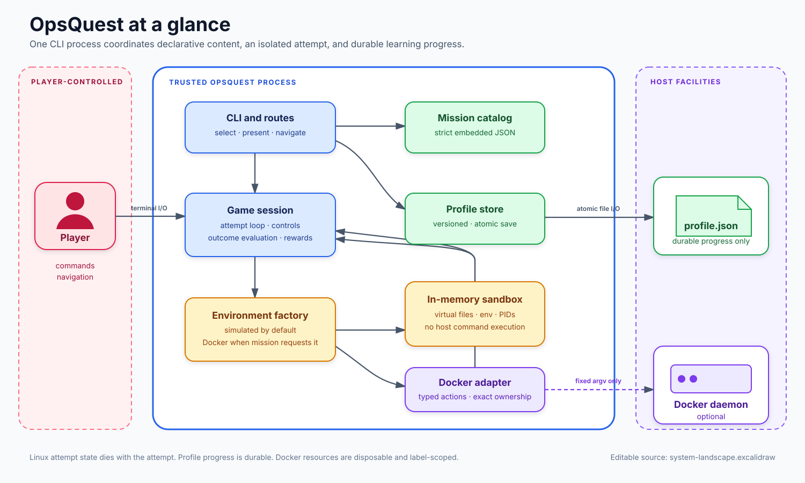
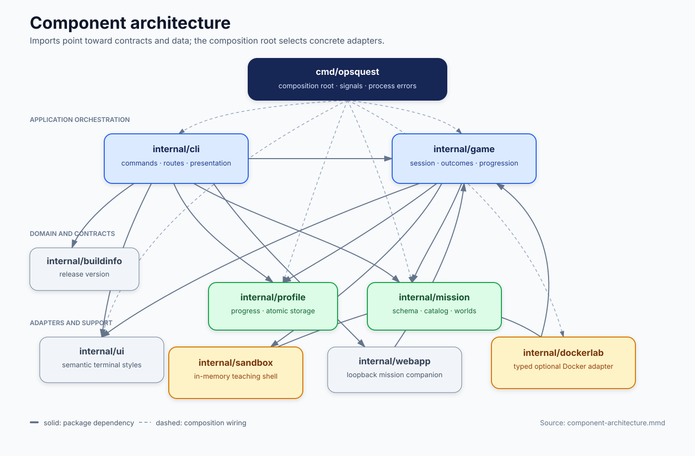
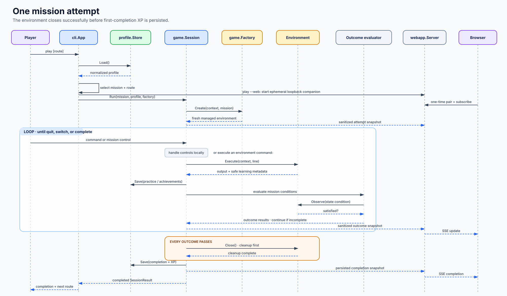

# OpsQuest architecture

OpsQuest separates product flow, declarative mission content, isolated execution, and durable player progress. The central seam is [`game.Environment`](https://github.com/Aleksandergreg/go-cli-tool/blob/main/internal/game/environment.go): a mission session can execute commands and observe outcomes without knowing whether the attempt uses the in-memory Linux simulator or the optional Docker adapter.

## System landscape



Editable source: [`system-landscape.excalidraw`](diagrams/system-landscape.excalidraw)

There are three materially different state domains:

| Domain | Owner | Lifetime | Host interaction |
| --- | --- | --- | --- |
| Mission definition | `internal/mission` | Embedded in the binary | Reads embedded JSON only |
| Mission attempt | `internal/sandbox` or `internal/dockerlab` | One attempt or restart | In-memory for Linux; exact labeled Docker resources for Docker labs |
| Player progress | `internal/profile` | Across processes | Atomic `profile.json` replacement in the platform config directory |

Linux mission state is never persisted. Completing, quitting, switching, or restarting a Linux mission discards its virtual filesystem, environment, processes, archives, and history. Hints, command practice, completions, XP, and achievements belong to the profile instead.

## Components and dependencies



Editable source: [`component-architecture.mmd`](diagrams/component-architecture.mmd)

| Package | Responsibility | Important boundary |
| --- | --- | --- |
| `cmd/opsquest` | Process entry point and dependency construction | Wires concrete adapters; contains no gameplay rules |
| `internal/cli` | Public commands, flags, route selection, and presentation | Owns profile loading/reset and chooses missions; delegates attempts to `game.Session` |
| `internal/game` | Attempt orchestration, terminal input/editor integration, progression, and outcome evaluation | Depends on the `Environment` and `Factory` contracts, not on Docker details |
| `internal/mission` | Strict schema, embedded catalog, tracks, worlds, and defensive copies | Content stays declarative; rejects invalid catalogs before play starts |
| `internal/sandbox` | Teaching-shell lexer, parser, dispatcher, virtual filesystem/processes/archives | Never invokes a host shell or accesses host paths |
| `internal/dockerlab` | Optional Docker-compatible engine availability, typed teaching actions, fixtures, observations, and cleanup | Only this adapter may launch the Docker CLI, using constructed arguments and tracked resource IDs |
| `internal/profile` | Versioned progress model and atomic JSON storage | The only normal durable state written by the application |
| `internal/ui` | Terminal capability detection and semantic ANSI roles | Styling stays out of execution results and validators |
| `internal/buildinfo` | Release-managed executable version | Updated by release automation |

Dependencies point toward contracts and data. In particular, `dockerlab` implements interfaces declared by `game`, while `game` does not import `dockerlab`. The composition root selects `dockerlab.NewFactory(game.SandboxFactory{})`, making the simulated environment the safe default and Docker an optional branch.

OrbStack does not introduce a second execution backend. On macOS it is selected through its official `orbstack` Docker context, while availability checks, fixed Docker CLI arguments, ownership verification, resource limits, and cleanup all remain on the same adapter path. Context inspection changes only provider-specific readiness guidance; a failed context inspection does not reject an otherwise reachable engine.

## Process startup

[`cmd/opsquest/main.go`](https://github.com/Aleksandergreg/go-cli-tool/blob/main/cmd/opsquest/main.go) performs a deliberately small composition sequence:

1. Create an interrupt-aware context.
2. Load and validate every embedded mission with `mission.LoadCatalog`.
3. Resolve the profile store with `profile.DefaultStore`.
4. Construct the CLI with standard streams, catalog, store, and the combined environment factory.
5. Dispatch `os.Args[1:]` through `cli.App.Run`.
6. Render any returned error once at the process boundary and exit non-zero.

Catalog loading is fail-fast. JSON decoding disallows unknown fields, mission numbers must be globally contiguous, IDs and numbers must be unique, setup and validation fields must match the selected environment, and campaigns must remain contiguous within each track.

## One mission attempt



Editable source: [`mission-runtime-sequence.mmd`](diagrams/mission-runtime-sequence.mmd)

The runtime flow is:

1. `cli.App` loads the profile and selects a mission using a recommended, sequential, or world-scoped route.
2. `game.Session` asks the configured `Factory` for a fresh `Environment` and wraps it in managed cleanup.
3. The session handles mission controls and navigation itself. Other input is passed to `Environment.Execute`.
4. Execution returns unstyled output plus safe learning metadata: practiced command names, maximum pipeline width, and an optional interactive action.
5. The session records command practice and related achievements, then persists the profile.
6. The validator compares output conditions directly and delegates state conditions to `Environment.Observe`.
7. If any outcome is missing, the same attempt continues. `status` describes satisfied and missing outcomes without prescribing a command sequence.
8. Once every outcome passes, the session closes the environment **before** awarding XP. This prevents a Docker attempt with unresolved cleanup from being recorded as complete.
9. First completion records hint-adjusted XP and achievements. Replays retain the original completion and award no duplicate XP.

`restart` closes the active environment and creates a new one from the same declarative mission. Mission switching returns a validated mission ID to the CLI, which starts a separate fresh session.

## The environment contract

An `Environment` represents exactly one isolated attempt:

```go
type Environment interface {
    PromptLabel() string
    Execute(context.Context, string) (Execution, error)
    Observe(context.Context, mission.Condition) (bool, error)
    CompletionSource() CompletionSource
    Close() error
}
```

The contract carries several design decisions:

- `Execute` performs only the environment's teaching subset. It does not accept an arbitrary process runner.
- `Observe` exposes outcomes rather than internal state, keeping validators environment-neutral.
- `CompletionSource` offers only environment-owned commands and paths. Session navigation completions are added at the game layer.
- `Close` must tolerate partial setup and be retryable after a cleanup error.
- Session calls are serial; implementations do not need concurrent `Execute`/`Close` support.
- Factories may return both a partial environment and an error. The managed wrapper closes that partial attempt before propagating the failure.

The simulated adapter wraps one `sandbox.Sandbox`. The Docker adapter maps logical mission aliases to generated names and exact container IDs, so neither the session nor player sees engine-owned resource identifiers.

## Mission and world model

Each JSON file decodes into a `mission.Mission` containing narrative fields, suggested tools, hints, setup, validation conditions, and rewards. The catalog sorts missions by stable global number and builds lookup indexes by ID and number.

Worlds are derived views rather than persisted schema. Within each track, each contiguous campaign becomes one ordered world; a mission's world and stage placement is computed at catalog load. Linux and Docker therefore have separate world numbering even though mission numbers are global. Catalog accessors return deep copies so callers cannot mutate embedded content.

See [Curriculum](../game/curriculum.md) for the current world and mission map.

## Persistence and compatibility

The profile schema is versioned independently from mission content. `Store.Load` accepts older supported data, normalizes additive fields and unsafe legacy display names, and rejects profiles written by a newer schema version. `Store.Save` clones map-backed state, validates the player name, writes an owner-only temporary file, syncs it, and atomically renames it over `profile.json`.

Compatibility-sensitive identifiers are:

- Mission IDs, used as keys for completions and hint progress.
- Global mission numbers, used by top-level public navigation.
- Profile schema version and JSON fields.
- Condition names and their allowed field shapes.
- Track/campaign ordering, which determines displayed world placement.

Changing one of these requires explicit compatibility reasoning even when the Go compiler reports no breakage.

## Where changes belong

| Desired change | Primary location | Usually also inspect |
| --- | --- | --- |
| Add or revise a mission | `internal/mission/data` | Catalog integrity and `internal/game/missions_test.go` |
| Add a simulated command or flag | `internal/sandbox` | Command help, regression/hardening tests, README command list |
| Add a validation outcome | `internal/mission`, `internal/game`, environment adapters | Strict schema checks and canonical mission coverage |
| Change attempt controls or progression | `internal/game` | `internal/cli` routes and profile persistence |
| Add a top-level command | `internal/cli` | Smoke test and README examples |
| Expand Docker teaching behavior | `internal/dockerlab` | Parser rejection tests, ownership cleanup, real integration gate |
| Change colors or terminal presentation | `internal/ui` | CLI/session rendering tests and non-terminal output |
| Change durable progress | `internal/profile` | Migration/compatibility tests and atomic-write behavior |

The repository's [agent guide](https://github.com/Aleksandergreg/go-cli-tool/blob/main/AGENTS.md) defines the safety invariants and quality gates for each category.
