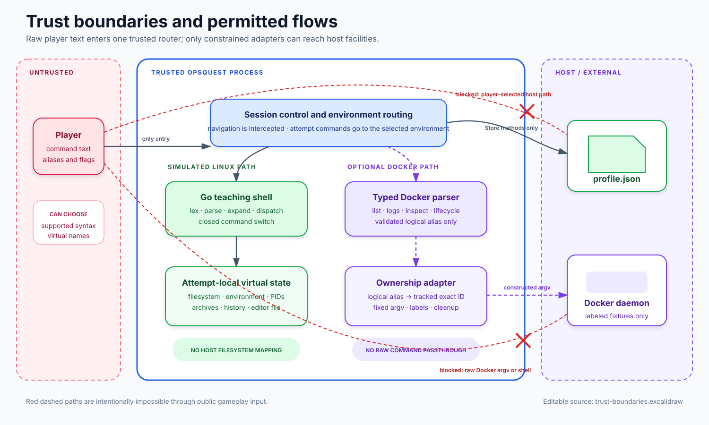
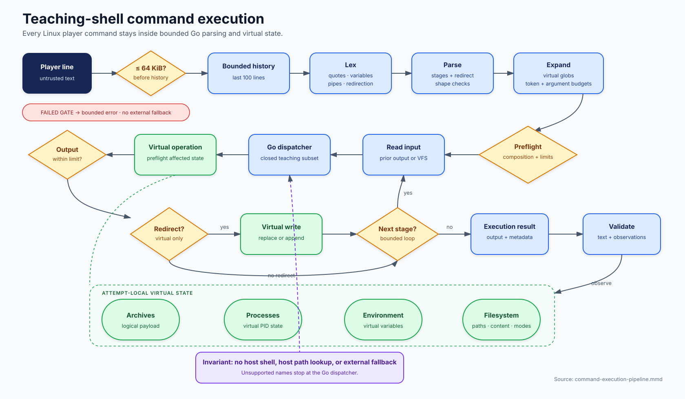

# OpsQuest sandbox and safety

OpsQuest has two execution models with different trust boundaries:

- Linux missions use a teaching shell implemented entirely in Go over in-memory state.
- Optional Docker missions parse a deliberately small command language and translate typed actions into fixed Docker CLI arguments for attempt-owned resources.

Neither model passes a raw player line to a host shell.

## Trust boundaries

Editable source: [`trust-boundaries.excalidraw`](diagrams/trust-boundaries.excalidraw)

The player controls command text and navigation choices. Trusted OpsQuest code decides whether that text is a session control, a simulated-shell command, or one of the supported Docker teaching forms. Only two components normally interact with durable or external host facilities:

- `profile.Store` reads and atomically replaces one configured profile file. Player commands cannot address this path.
- `dockerlab.execRunner` invokes the discovered Docker executable with arguments constructed inside `internal/dockerlab`. It never invokes `sh -c` and never forwards the original line.

## Linux command execution

Editable source: [`command-execution-pipeline.mmd`](diagrams/command-execution-pipeline.mmd)

[`Sandbox.Execute`](../../internal/sandbox/shell.go) processes a line in explicit stages:

1. **Bound input:** reject a command line over 64 KiB before adding it to the attempt's 100-entry history.
2. **Lex:** recognize words, quotes, escapes, comments, variables, pipes, and `<`, `>`, or `>>`. Expansion reads only the sandbox environment.
3. **Parse:** build pipeline stages and attach at most one input and output redirection to each stage.
4. **Expand:** resolve eligible globs against the virtual filesystem and enforce expanded token and argument budgets.
5. **Preflight compositions:** reject unsupported interactive-editor or script placement before an earlier pipeline stage can mutate state.
6. **Dispatch:** call a Go method from the supported-command switch. Nested `find -exec` and scripts share dispatch budgets.
7. **Move virtual data:** pipeline output becomes the next stage's input; redirection reads or writes only virtual files.
8. **Return learning metadata:** output, successful command names, maximum pipeline width, or a virtual editor request flow back to `game.Session`.
9. **Observe outcomes:** output validators compare the returned text; state validators query the active environment.

Unsupported commands fail at dispatch. The shell implements a teaching subset, not process lookup, so a name absent from the dispatcher can never fall through to the host.

A full pipeline is not one transaction: an ordinary earlier stage may mutate virtual state before a later stage fails. Safety-sensitive operations preflight their own affected state, and compositions known to be unsupported (`vi` in a pipeline, or a script receiving pipeline/file input) are rejected before any stage runs.

## Virtual state model

One `sandbox.Sandbox` owns:

| State | Representation | Persistence |
| --- | --- | --- |
| Files and directories | Normalized absolute paths to typed entries with content, mode, and owner | Attempt only |
| Working directory | Virtual absolute path | Attempt only; child scripts restore caller scope |
| Environment | String map initialized with virtual `HOME` and `USER` | Attempt only; exported child-script values restore on return |
| Processes | Mission-provided PID map and running flags | Attempt only; no host PID is visible or signalable |
| Archives | Logical archive metadata and payload entries | Attempt only; kept synchronized with virtual path mutations |
| History | Last 100 accepted command lines | Attempt only |

Paths are cleaned relative to the virtual current directory. The filesystem has its own `/`; it is not mounted or mapped to the host filesystem. Recursive writes, copies, archive operations, environment updates, and other amplifying operations calculate their budget before publishing the change. Virtual root/current-directory removal, file/directory type corruption, and archive extraction outside the chosen virtual destination are rejected.

The modal `vi` implementation is also virtual. `sandbox` returns an editor request, `game` handles terminal keys, and saving calls back into `Sandbox.SaveEditorFile`; no host editor or file API receives the virtual path.

## Resource ceilings

The limits are part of the isolation model, not tuning suggestions.

| Resource | Limit |
| --- | ---: |
| Command line | 64 KiB |
| Expanded token text | 2 MiB |
| Expanded arguments | 4,096 |
| Pipeline stages | 64 |
| Dispatches per execution, including nested work | 512 |
| One virtual file | 2 MiB |
| One command's output | 2 MiB |
| Total virtual file content | 8 MiB |
| Virtual filesystem entries | 4,096 |
| Virtual path | 4,096 bytes |
| Owner value | 256 bytes |
| Logical archive payload | 8 MiB |
| Logical archive entries | 4,096 |
| Environment entries | 256 |
| Environment data | 256 KiB |
| Script file / line | 64 KiB / 8 KiB |
| Script nesting / dispatched commands | 8 / 256 |
| Script output | 1 MiB |
| `vi` file | 256 KiB |

Scripts are interpreted line by line through the same lexer, parser, expander, and dispatcher. They can use supported commands, variables, pipelines, and virtual redirection, but not loops, conditionals, functions, substitutions, background jobs, external programs, `sh -c`, stdin-fed source, or interactive editor calls.

## Docker teaching boundary

Docker missions are opt-in and follow a narrower path:

1. The mission catalog accepts only pinned image references and bounded logical fixtures.
2. Availability checks the Docker executable, daemon, and exact local image without creating resources or pulling images.
3. The factory generates a random session ID and creates containers with generated names and five ownership labels.
4. Player text is parsed into `list`, `start`, `restart`, `inspect`, or `help`; flags and aliases must match the small grammar.
5. The adapter resolves a validated logical alias to a tracked exact container ID.
6. `exec.CommandContext` receives fixed arguments constructed by the adapter.
7. Observations inspect exact IDs or enumerate by the session label, then verify the complete ownership-label set.
8. `Close` seals the attempt immediately, re-inspects ownership, removes only matching exact IDs, and retains unresolved resources for a retry.

Created containers use no network, a read-only root filesystem, a bounded temporary filesystem, an unprivileged numeric user, no Linux capabilities, `no-new-privileges`, and explicit PID, memory, CPU, file-descriptor, restart, and stop-timeout limits. They do not receive host bind mounts, devices, privileged mode, host networking, or a Docker socket.

Docker-specific ceilings include:

| Resource | Limit |
| --- | ---: |
| Player Docker line | 64 KiB |
| Images per mission | 16 |
| Containers per mission | 32 |
| Captured Docker stdout and stderr | 2 MiB each |
| Normal Docker operation | 10 seconds |
| Cleanup attempt | 10 seconds |

The Docker daemon remains a powerful external dependency; OpsQuest reduces exposure by constraining syntax, setup, runtime options, identity, and cleanup scope. It does not claim to turn an untrusted Docker daemon into a security boundary.

## Threat-to-control map

| Threat | Primary controls | Evidence location |
| --- | --- | --- |
| Player launches a host command | Closed Go dispatcher; no fallback process lookup; raw line never reaches a shell | `internal/sandbox/shell.go`, hardening tests |
| Player reads or writes a host path | Independent in-memory root and virtual path resolver | `internal/sandbox/filesystem.go`, regression tests |
| Expansion exhausts memory | Line, token, argument, output, entry, and aggregate budgets | quota tests in `internal/sandbox` |
| Archive escapes extraction target | Strict metadata validation and destination containment | archive and hardening tests |
| Script bypasses shell restrictions | Same parser/dispatcher, bounded nesting and steps, unsupported syntax rejection | `commands_script.go` and tests |
| Docker input becomes arbitrary CLI flags | Typed parser accepts only exact actions and validated logical aliases | `internal/dockerlab/parser.go` and tests |
| Cleanup removes another container | Exact ID plus managed/schema/session/mission/alias label verification | `internal/dockerlab/environment.go` and tests |
| Partial Docker setup leaks resources silently | Factory may return a partial environment; managed cleanup and retryable `Close` | `internal/dockerlab/factory.go`, environment contract tests |
| Persisted display text injects terminal controls | Profile names reject non-printable characters and normalize legacy values | `internal/profile/profile.go` and tests |

## Safety review checklist

Changes that affect parsing, paths, recursion, redirection, scripts, archives, quotas, Docker execution, or environment cleanup should verify all of the following:

- Player-controlled text still cannot become host shell input or an unrestricted process argument.
- Paths resolve only in the active virtual filesystem or to an exact adapter-owned resource.
- Failure paths preserve existing state where an operation promises preflight or atomic publication.
- Success, boundary, and rejection behavior have focused tests.
- Mission validators continue to test observable results rather than a command transcript.
- `make check-all` passes; Docker adapter changes also run `make docker-integration` when prerequisites are available.

The authoritative implementation is the code and tests. This guide explains their intended security properties; if a diagram and a tested invariant disagree, treat the mismatch as a documentation defect.
